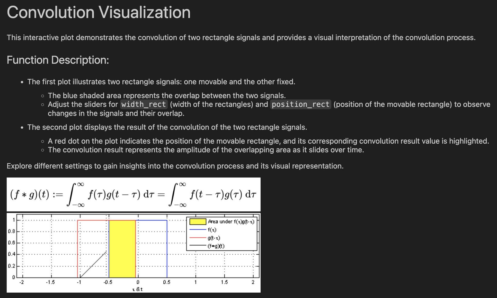
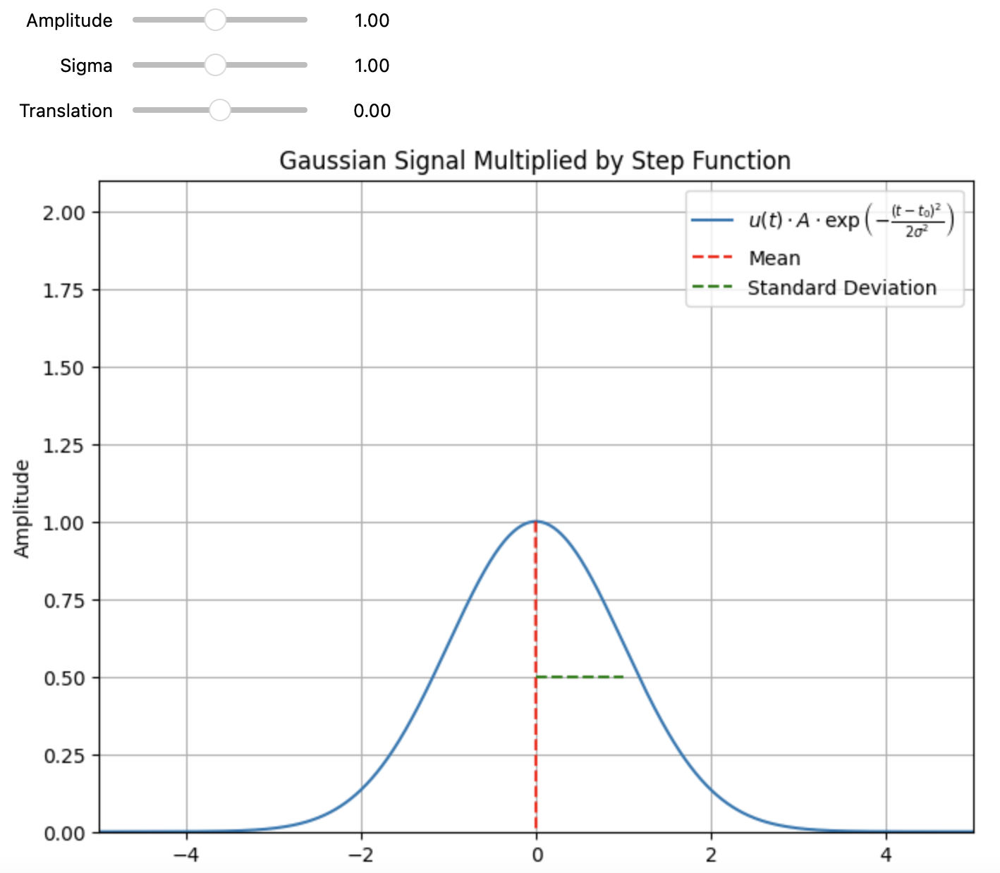

# Signal Theory

This is a free repository with the aim to create usefull interactive python scripts to better understand the topics of the Signal Theory

## Rules

The aim is to create interactive python notebooks via sliders or any other GUI that can be used in an interactive way to deeply understand the specific topic. 

Example description:
 

Example GUI:
 

## Structure

The topics already studied correspond to their python notebook name. Here there is the list:

- convolution.ipynb
- signals.ipynb

All the images needed in the description of the python notebook are in the folder:

* images/

## Collaboration

Feel free to update the repository by improving the explainability of the existing scripts, or add new scripts that show a new topic.
